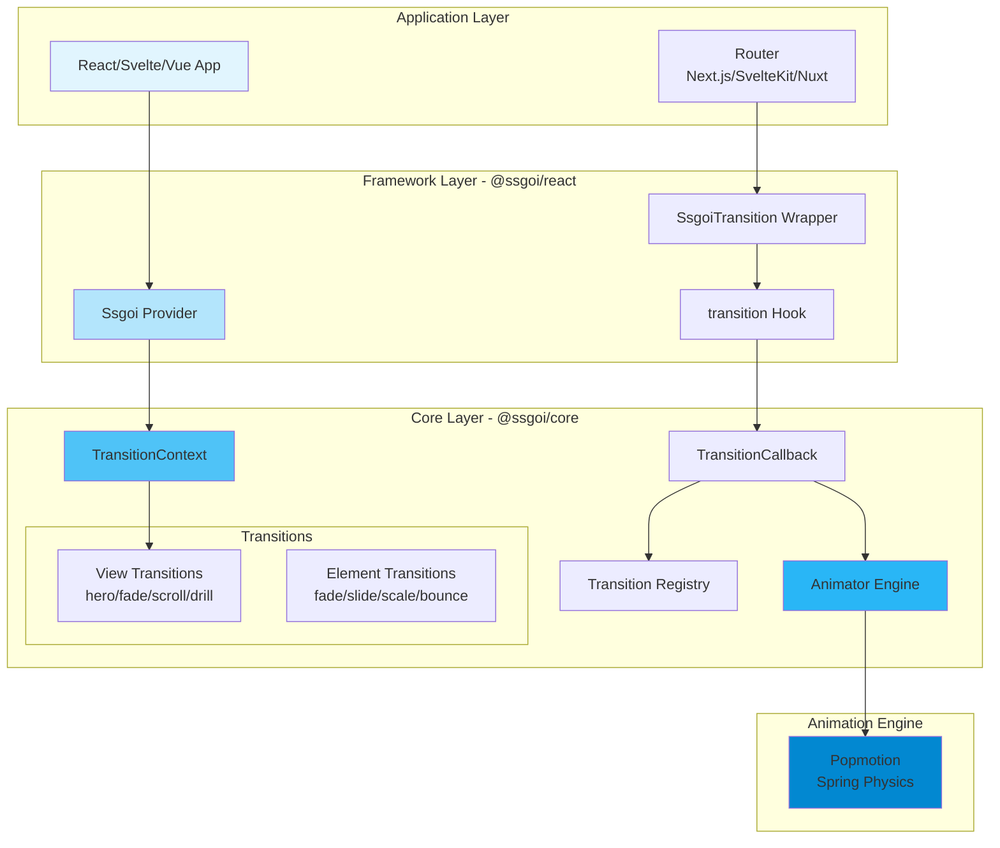
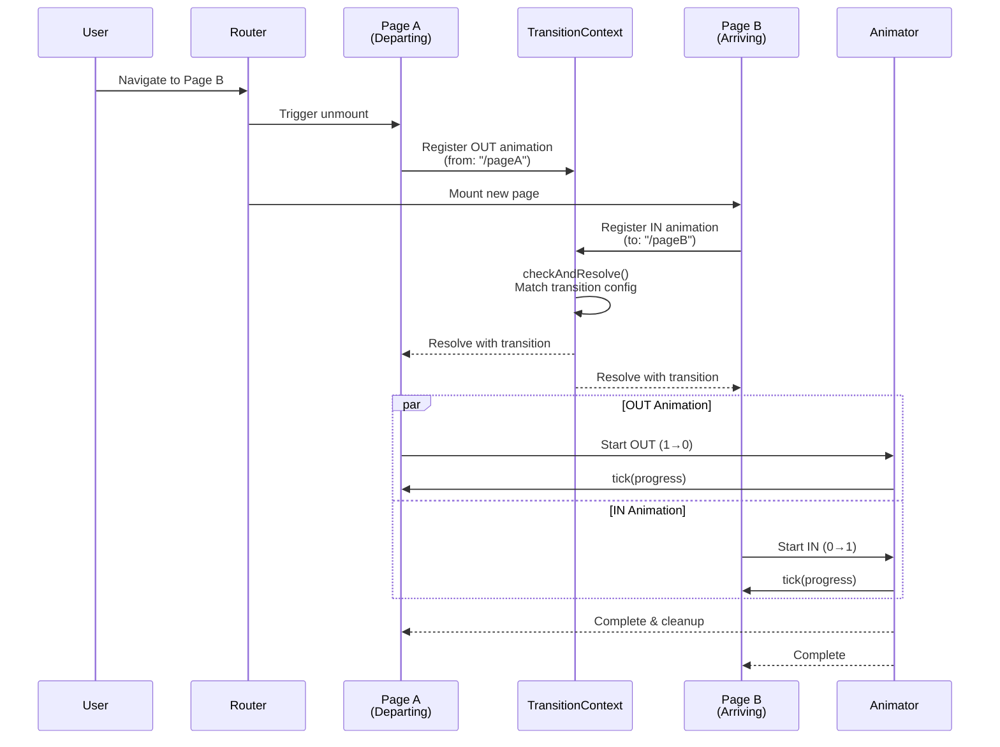
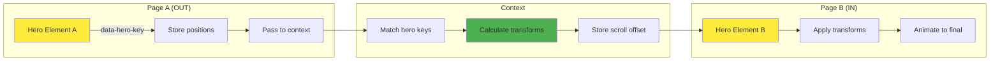
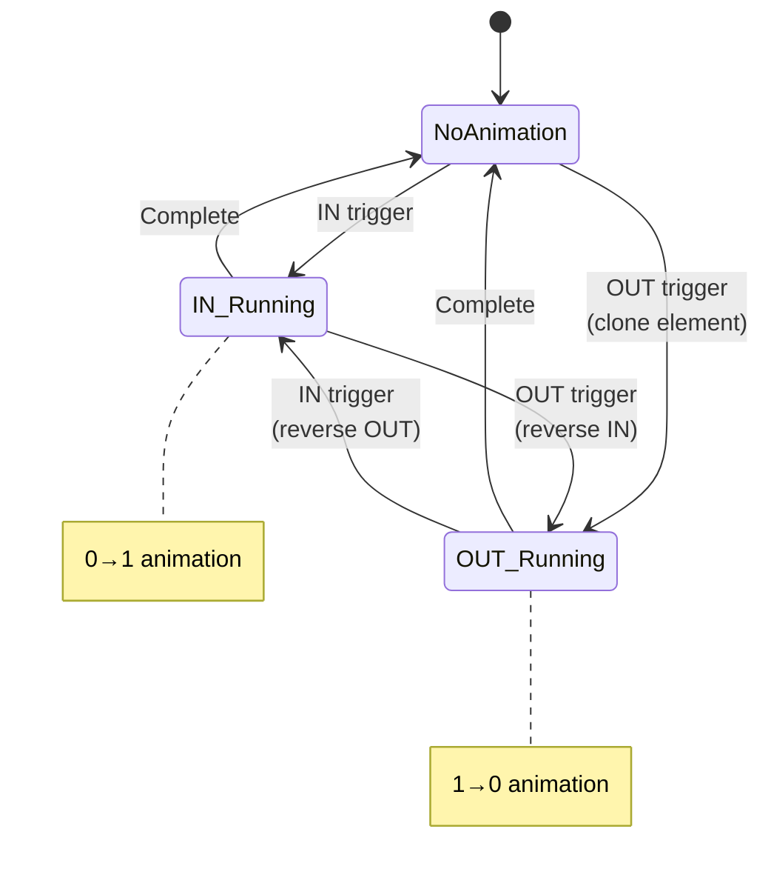
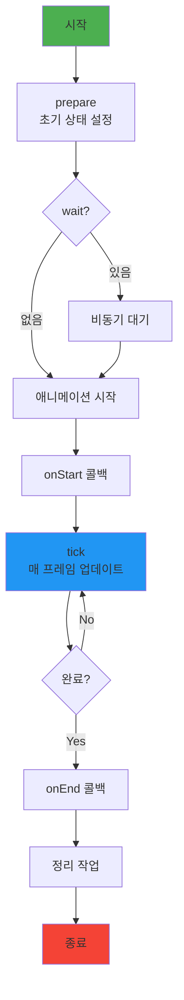
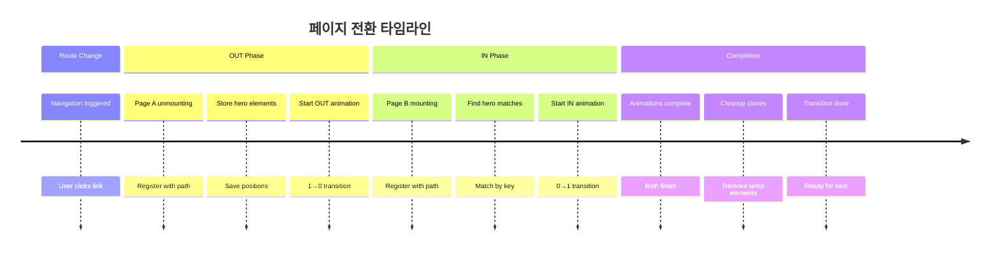

# SSGOI 아키텍처 심층 분석 보고서

## 📋 목차
1. [프로젝트 개요](#프로젝트-개요)
2. [전체 아키텍처 다이어그램](#전체-아키텍처-다이어그램)
3. [계층별 상세 분석](#계층별-상세-분석)
4. [데이터 흐름 분석](#데이터-흐름-분석)
5. [핵심 알고리즘](#핵심-알고리즘)
6. [애니메이션 생명주기](#애니메이션-생명주기)
7. [주요 컴포넌트 상호작용](#주요-컴포넌트-상호작용)
8. [기여자를 위한 가이드](#기여자를-위한-가이드)

## 프로젝트 개요

SSGOI는 브라우저 네이티브 View Transition API의 한계를 극복하고, 모든 브라우저에서 동작하는 유니버설 페이지 전환 라이브러리입니다.

### 핵심 특징
- ✅ **크로스 브라우저 지원**: Chrome, Firefox, Safari 모두 지원
- ✅ **프레임워크 중립적**: React, Svelte, Vue 통합 제공
- ✅ **물리 기반 애니메이션**: Popmotion 스프링 물리 엔진 사용
- ✅ **SSR 최적화**: 하이드레이션 이슈 없음
- ✅ **라우터 독립적**: 모든 라우팅 솔루션과 호환

## 전체 아키텍처 다이어그램



## 계층별 상세 분석

### 1️⃣ Application Layer (React Demo App)

```typescript
// app/layout.tsx
const ssgoiConfig = {
  transitions: [
    {
      from: "/",
      to: "/item/*",
      transition: hero({ spring: { stiffness: 5, damping: 1 } }),
      symmetric: true
    }
  ]
};

<Ssgoi config={ssgoiConfig}>
  {children}
</Ssgoi>
```

```typescript
// app/page.tsx
<SsgoiTransition id="/">
  <div data-hero-key={`color-${item.id}`}>
    {/* 히어로 전환 요소 */}
  </div>
</SsgoiTransition>
```

### 2️⃣ Framework Layer (@ssgoi/react)

#### 컴포넌트 구조
```
@ssgoi/react/
├── ssgoi.tsx           # Provider 컴포넌트
├── ssgoi-transition.tsx # 페이지 래퍼
├── context.tsx         # React Context
└── transition.ts       # Hook re-export
```

#### 핵심 구현
```typescript
// ssgoi.tsx - Provider 생성
export const Ssgoi = ({ config, children }) => {
  const contextValue = useMemo(
    () => createSggoiTransitionContext(config),
    [config]
  );
  return <SsgoiProvider value={contextValue}>{children}</SsgoiProvider>;
};

// ssgoi-transition.tsx - 페이지 래핑
export const SsgoiTransition = ({ children, id }) => {
  const getTransition = useSsgoi();
  return (
    <div ref={transition(getTransition(id))} data-ssgoi-transition={id}>
      {children}
    </div>
  );
};
```

### 3️⃣ Core Layer (@ssgoi/core)

#### 핵심 모듈 구조
```
@ssgoi/core/
├── create-ssgoi-transition-context.ts  # 페이지 전환 조정
├── create-transition-callback.ts       # 애니메이션 상태 머신
├── animator.ts                         # 물리 엔진
├── transition.ts                       # 전환 레지스트리
├── transitions/                        # 요소 전환
└── view-transitions/                   # 페이지 전환
```

## 데이터 흐름 분석

### 🔄 페이지 전환 시퀀스 다이어그램



### 🎯 Hero Transition 데이터 흐름



## 핵심 알고리즘

### 1. 애니메이션 상태 머신



### 2. 페이지 전환 조정 알고리즘

```typescript
// Pending Transition Resolution
type PendingTransition = {
  from?: string;        // 출발 페이지
  to?: string;          // 도착 페이지  
  outResolve?: Function; // OUT Promise resolver
  inResolve?: Function;  // IN Promise resolver
};

function checkAndResolve() {
  if (pendingTransition.from && pendingTransition.to) {
    // 1. 경로 매칭으로 전환 설정 찾기
    const config = findMatchingTransition(from, to);
    
    // 2. 양쪽 Promise 동시 해결
    pendingTransition.outResolve(config);
    pendingTransition.inResolve(config);
    
    // 3. 정리
    pendingTransition = {};
  }
}
```

### 3. 스프링 물리 계산

```typescript
// Popmotion Spring Configuration
{
  stiffness: 300,  // 스프링 강도 (높을수록 빠름)
  damping: 30,     // 감쇠 (높을수록 덜 튀김)
  mass: 1,         // 질량 (고정값)
  velocity: 0      // 초기 속도
}

// 속도 보존 (중단 시)
normalizedVelocity = (current - previous) / deltaTime / 1000;

// 자연스러운 역전
animator.reverse() → velocity = -velocity
```

### 4. Hero 요소 변환 계산

```typescript
// 기하학적 변환 계산
function calculateTransform(fromRect, toRect, scrollOffset, progress) {
  const dx = fromRect.left - toRect.left - scrollOffset.x;
  const dy = fromRect.top - toRect.top - scrollOffset.y;
  const dw = fromRect.width / toRect.width;
  const dh = fromRect.height / toRect.height;
  
  return {
    translateX: (1 - progress) * dx,
    translateY: (1 - progress) * dy,
    scaleX: progress + (1 - progress) * dw,
    scaleY: progress + (1 - progress) * dh
  };
}
```

## 애니메이션 생명주기

### 요소 전환 생명주기



### 페이지 전환 생명주기



## 주요 컴포넌트 상호작용

### 컴포넌트 협업 다이어그램

```mermaid
graph TB
    subgraph "User Interaction"
        Click[사용자 클릭]
    end
    
    subgraph "React Layer"
        Link[Next.js Link]
        Layout[Layout + Ssgoi]
        PageComp[Page Component]
    end
    
    subgraph "Transition Layer"
        TransWrapper[SsgoiTransition]
        Hook[transition()]
    end
    
    subgraph "Core Engine"
        Context[TransitionContext]
        Callback[TransitionCallback]
        Animator[Animator]
        Registry[Registry]
    end
    
    subgraph "DOM"
        Original[Original Element]
        Clone[Cloned Element]
    end
    
    Click --> Link
    Link --> Layout
    Layout --> Context
    PageComp --> TransWrapper
    TransWrapper --> Hook
    Hook --> Callback
    Callback --> Registry
    Callback --> Animator
    Animator --> Original
    Animator --> Clone
    
    Context -.->|config| Callback
    Registry -.->|cleanup| Callback
    
    style Click fill:#ffd54f
    style Animator fill:#4fc3f7
    style Clone fill:#ef5350,stroke-dasharray: 5 5
```

### 데이터 흐름 매트릭스

| 컴포넌트 | 입력 | 처리 | 출력 |
|---------|------|------|------|
| **Ssgoi Provider** | config | Context 생성 | TransitionContext |
| **SsgoiTransition** | id, children | ref 콜백 생성 | DOM with transition |
| **TransitionContext** | from, to paths | 경로 매칭 | transition config |
| **TransitionCallback** | IN/OUT trigger | 상태 머신 | animation control |
| **Animator** | spring config | 물리 계산 | progress updates |
| **Registry** | transition key | 생명주기 관리 | cleanup |

## 기여자를 위한 가이드

### 🚀 새로운 전환 효과 추가하기

#### 1. 요소 전환 추가 (Element Transition)
```typescript
// packages/core/src/lib/transitions/새효과.ts
export function 새효과In(config?: SpringConfig): TransitionConfig {
  return {
    prepare: (element) => {
      // 초기 상태 설정
    },
    in: (element) => ({
      spring: config,
      tick: (progress) => {
        // 애니메이션 업데이트
        element.style.transform = `...`;
      }
    })
  };
}
```

#### 2. 페이지 전환 추가 (View Transition)
```typescript
// packages/core/src/lib/view-transitions/새전환.ts
export function 새전환(config?: Config): ViewTransition {
  return {
    out: async (element, scrollOffset) => {
      // OUT 애니메이션 (1→0)
      return {
        spring: config?.spring,
        tick: (progress) => {
          element.style.opacity = String(progress);
        }
      };
    },
    in: async (element, data, scrollOffset) => {
      // IN 애니메이션 (0→1)
      return {
        spring: config?.spring,
        tick: (progress) => {
          element.style.opacity = String(progress);
        }
      };
    }
  };
}
```

### 🔍 디버깅 포인트

#### 주요 디버깅 위치
1. **페이지 전환 매칭**: `create-ssgoi-transition-context.ts:143`
2. **애니메이션 상태 변경**: `create-transition-callback.ts:73-120`
3. **스프링 물리 계산**: `animator.ts:47-89`
4. **Hero 요소 매칭**: `view-transitions/hero.ts:35-67`

#### 일반적인 이슈와 해결법

| 문제 | 원인 | 해결 방법 |
|-----|------|----------|
| 전환이 발생하지 않음 | 경로 매칭 실패 | config의 from/to 패턴 확인 |
| 애니메이션 끊김 | 속도 보존 실패 | Animator.fromState() 확인 |
| Hero 전환 실패 | data-hero-key 불일치 | 양쪽 페이지 key 확인 |
| 메모리 누수 | cleanup 미실행 | Registry cleanup 확인 |

### 📊 성능 최적화 체크리스트

- [ ] **애니메이션 프레임 최적화**: requestAnimationFrame 사용 확인
- [ ] **DOM 조작 최소화**: batch update, transform 사용
- [ ] **메모리 관리**: FinalizationRegistry 활용
- [ ] **스프링 파라미터**: stiffness/damping 균형
- [ ] **요소 복제**: 필요한 경우만 clone 생성

### 🧪 테스트 전략

```bash
# 1. 유닛 테스트 - Core 로직
pnpm test:core

# 2. 통합 테스트 - 프레임워크별
pnpm test:react
pnpm test:svelte
pnpm test:vue

# 3. E2E 테스트 - 실제 전환
pnpm test:e2e

# 4. 성능 테스트
pnpm test:perf
```

## 맺음말

SSGOI는 **물리 기반 애니메이션**, **프레임워크 중립적 설계**, **효율적인 상태 관리**를 통해 웹에서 네이티브 앱 수준의 페이지 전환을 구현합니다. 

핵심 강점:
- ✨ **자연스러운 전환**: 스프링 물리와 속도 보존
- 🎯 **정교한 조정**: 양방향 페이지 간 동기화
- 🔧 **확장 가능**: 모듈화된 구조로 쉬운 커스터마이징
- 📦 **경량**: 트리 쉐이킹, 최소 번들 크기

이 보고서가 SSGOI 프로젝트 기여에 도움이 되기를 바랍니다! 🚀